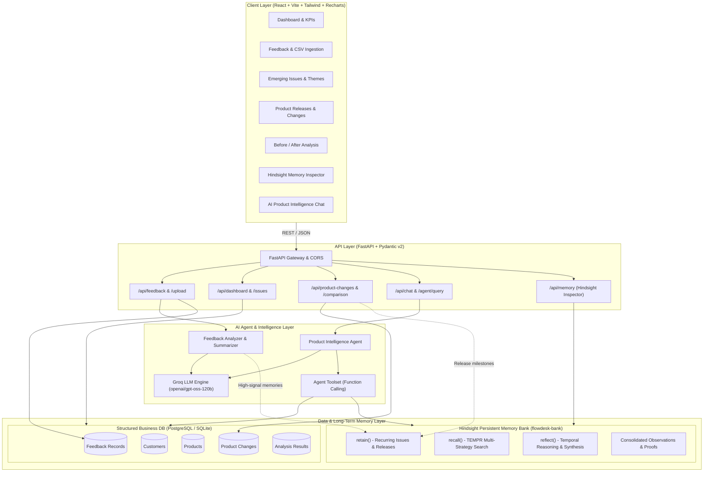
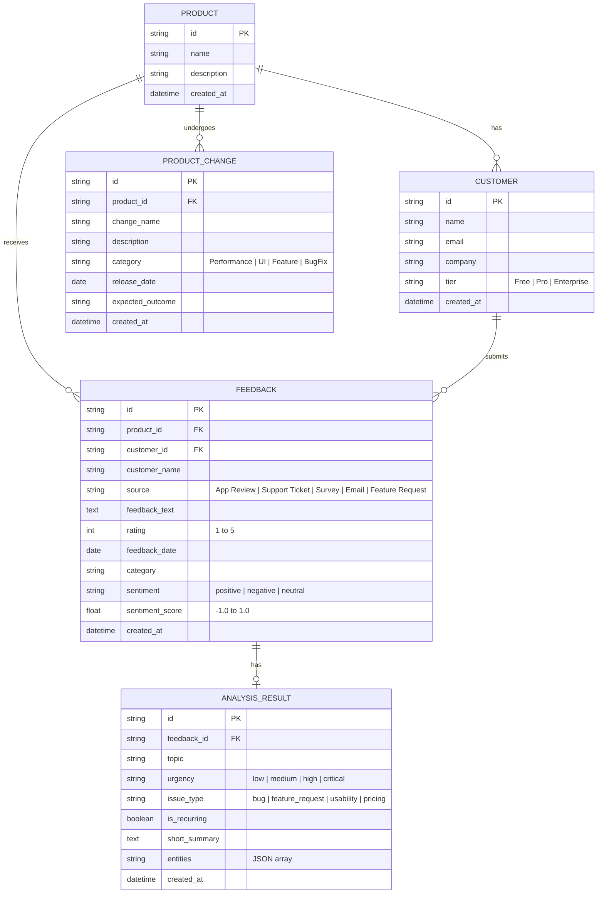
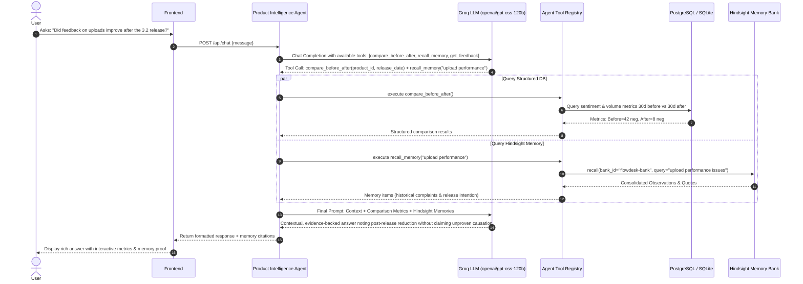

# Product Feedback Intelligence Agent (FlowDesk)
## Phase 1: System Architecture & Design Specification

---

### 1. Executive Summary & Problem Statement

Modern product teams receive thousands of unstructured feedback items across diverse channels: support tickets, app reviews, NPS surveys, sales calls, and social posts. Traditional tooling either:
1. Stores feedback as flat, static rows in a database without deep temporal comprehension, or
2. Runs one-off stateless LLM queries that have no memory of past customer pain points or past product updates.

**Product Feedback Intelligence Agent** solves this by bridging structured operational data (PostgreSQL/SQLAlchemy) with state-of-the-art **persistent agent memory (Hindsight)** and ultra-fast LLM reasoning (**Groq**).

The agent acts as an autonomous Product Intelligence Analyst that remembers:
- Historical customer complaints and recurring bugs.
- Major product releases, bug fixes, and feature launches.
- Sentiment shifts and trend trajectory before vs. after releases.
- Evolution of customer requests across versions.

---

### 2. Workspace & Environment Inspection Findings

| Component | Status | Details |
|---|---|---|
| **Workspace Directory** | Clean | `c:\Users\HP\Desktop\Hackthons\Hackwithhyderabhad2` (Empty initialized root) |
| **Python** | Installed | Python 3.14.2 with `pip 26.1.2` |
| **Key Python Packages** | Ready | `fastapi 0.141.1`, `pydantic 2.13.4`, `sqlalchemy 2.0.46`, `httpx 0.28.1`, `pandas 3.0.0` |
| **Groq Client** | Verified | `groq 1.7.0` (tested installability on Python 3.14) |
| **Hindsight Client** | Verified | `hindsight-client 0.10.1` (official Python SDK with `retain`, `recall`, `reflect`) |
| **Node.js & npm** | Installed | Node `v24.15.0` & npm `11.12.1` available locally |
| **Docker** | Installed | Docker `29.8.0` (Docker Desktop) |
| **Database** | Configured | Dual-mode: SQLite for zero-setup local dev; PostgreSQL for Docker Compose |
| **API Keys / Env** | Unset | Will create `.env.example` with clear instructions for `GROQ_API_KEY`, `HINDSIGHT_API_KEY`, etc. |

---

### 3. Core System Architecture



---

### 4. Memory vs. Database Strategy

A pivotal requirement of this project is avoiding the misconception that Hindsight replaces PostgreSQL, or vice versa:

| Dimension | PostgreSQL / SQLite (Structured Storage) | Hindsight (Persistent Agent Memory) |
|---|---|---|
| **Purpose** | ACID transactional store for operational application data | Episodic & semantic memory for AI agent reasoning across time |
| **Typical Data** | Exact row ID, timestamp, customer email, raw text, star rating, product FK | "Customers in Q3 frequently report slow uploads on files > 50MB." |
| **Query Pattern** | `SELECT COUNT(*), AVG(rating) FROM feedback WHERE ...` | Multi-strategy TEMPR search + LLM reflection on trends |
| **Retention Policy** | Every single feedback item (raw truth) | High-signal synthesized observations, release milestones, behavioral shifts |
| **Evolution** | Rows are static once inserted | Observations continuously refine, deduplicate, and track evidence count |

#### Hindsight Memory Policy:
1. **WHAT is stored**:
   - Significant recurring pain points (e.g., "File uploads timing out on large videos").
   - Feature requests reaching critical mass.
   - Product change events (e.g., "Release 3.2: Chunked Upload Optimizer released on 2026-10-15").
   - Observed outcome shifts (e.g., "Feedback post-Release 3.2 indicates upload complaints decreased by 75%").
2. **WHAT is NOT stored**:
   - Raw individual greetings ("Hi", "Thanks", trivial noise).
   - Sensitive PII (passwords, payment cards, tokens).
   - Temporary UI state or session cookies.
3. **WHEN it is stored**:
   - During feedback batch ingestion when sentiment is strongly negative or marked as high-urgency bug/feature request.
   - When a Product Manager records a new Product Change.
   - When the agent conducts a Before/After comparison analysis.

---

### 5. Proposed Folder Structure

```
Hackwithhyderabhad2/
├── .env.example
├── .gitignore
├── docker-compose.yml
├── README.md
├── docs/
│   ├── ARCHITECTURE.md
│   ├── HINDSIGHT.md
│   ├── API_SPEC.md
│   └── DEMO_SCRIPT.md
├── data/
│   ├── sample_feedback.csv
│   └── generate_sample_data.py
├── backend/
│   ├── Dockerfile
│   ├── requirements.txt
│   ├── app/
│   │   ├── __init__.py
│   │   ├── main.py
│   │   ├── config.py
│   │   ├── database.py
│   │   ├── models/
│   │   │   ├── __init__.py
│   │   │   ├── feedback.py
│   │   │   ├── customer.py
│   │   │   ├── product.py
│   │   │   ├── product_change.py
│   │   │   └── analysis.py
│   │   ├── schemas/
│   │   │   ├── __init__.py
│   │   │   ├── feedback.py
│   │   │   ├── product_change.py
│   │   │   ├── dashboard.py
│   │   │   ├── chat.py
│   │   │   └── memory.py
│   │   ├── api/
│   │   │   ├── __init__.py
│   │   │   ├── routes_feedback.py
│   │   │   ├── routes_dashboard.py
│   │   │   ├── routes_product_changes.py
│   │   │   ├── routes_chat.py
│   │   │   └── routes_memory.py
│   │   ├── hindsight/
│   │   │   ├── __init__.py
│   │   │   ├── client.py
│   │   │   ├── memory_manager.py
│   │   │   └── bank_config.py
│   │   ├── groq/
│   │   │   ├── __init__.py
│   │   │   ├── client.py
│   │   │   └── prompts.py
│   │   ├── agents/
│   │   │   ├── __init__.py
│   │   │   ├── product_agent.py
│   │   │   └── tools.py
│   │   └── services/
│   │       ├── __init__.py
│   │       ├── triage_service.py
│   │       ├── analytics_service.py
│   │       └── comparison_service.py
│   └── tests/
│       ├── test_feedback.py
│       ├── test_analytics.py
│       ├── test_hindsight.py
│       └── test_agent_tools.py
└── frontend/
    ├── Dockerfile
    ├── package.json
    ├── tsconfig.json
    ├── vite.config.ts
    ├── tailwind.config.js
    ├── index.html
    └── src/
        ├── main.tsx
        ├── App.tsx
        ├── index.css
        ├── api/
        │   └── client.ts
        ├── types/
        │   └── index.ts
        ├── layouts/
        │   ├── MainLayout.tsx
        │   ├── Sidebar.tsx
        │   └── Header.tsx
        ├── pages/
        │   ├── DashboardPage.tsx
        │   ├── FeedbackPage.tsx
        │   ├── UploadPage.tsx
        │   ├── IssuesPage.tsx
        │   ├── FeatureRequestsPage.tsx
        │   ├── ProductChangesPage.tsx
        │   ├── BeforeAfterPage.tsx
        │   ├── MemoryDemoPage.tsx
        │   └── AssistantPage.tsx
        └── components/
            ├── MetricCard.tsx
            ├── SentimentBadge.tsx
            ├── SentimentChart.tsx
            ├── VolumeChart.tsx
            ├── TopicsChart.tsx
            ├── MemoryCard.tsx
            ├── ChatWindow.tsx
            └── BeforeAfterCard.tsx
```

---

### 6. Database Design (Entity Relationship Model)



---

### 7. REST API Design

| Method | Endpoint | Description | Status Codes |
|---|---|---|---|
| `POST` | `/api/feedback` | Ingest single feedback item (stores to DB + triages + selective Hindsight retain) | 201, 400 |
| `GET` | `/api/feedback` | Paginated, filtered list of feedback (by product, sentiment, source, category, date) | 200 |
| `GET` | `/api/feedback/{id}` | Retrieve individual feedback record with full AI analysis metadata | 200, 404 |
| `POST` | `/api/feedback/upload` | Upload CSV with progress stats (Total, Processed, Validated, Ingested) | 200, 400, 422 |
| `GET` | `/api/dashboard` | Aggregated metrics: sentiment breakdown, volume over time, top issues, sources | 200 |
| `GET` | `/api/issues` | Emerging and recurring issues with growth trajectory and sentiment impact | 200 |
| `GET` | `/api/feature-requests`| Top feature requests with mention count, sentiment, and sample quotes | 200 |
| `POST` | `/api/product-changes`| Log a new product change milestone (stores in DB + retains in Hindsight) | 201, 400 |
| `GET` | `/api/product-changes` | List product changes with associated metadata | 200 |
| `GET` | `/api/product-changes/{id}/comparison` | Before vs. After release statistical & AI-synthesized comparative analysis | 200, 404 |
| `POST` | `/api/chat` | AI Assistant query execution (Groq + Function Calling + Hindsight Memory) | 200, 500 |
| `GET` | `/api/memory` | Direct inspection of Hindsight memory bank observations, facts, and beliefs | 200 |
| `POST` | `/api/memory/search` | Search Hindsight memory bank via `recall()` | 200 |
| `POST` | `/api/memory/reflect` | Query Hindsight reasoning engine via `reflect()` | 200 |

---

### 8. AI Agent Workflow & Tooling

The AI Agent does **not** rely on brute-force context stuffing. Instead, it utilizes Groq Function Calling with safe deterministic tools:



---

### 9. Demo Scenario & Fictional Company: "FlowDesk"

- **Company**: **FlowDesk** — Modern collaboration and asynchronous workflow suite for fast-moving engineering teams.
- **Product Modules**: Large file uploads, interactive reporting dashboard, Slack/Jira integration, notification engine.
- **Timeline Storyline**:
  - **T1 (Initial period)**: Flood of customer feedback: "Uploading screen recordings over 100MB times out", "Upload speed is agonizingly slow".
  - **T2 (Agent Retention)**: The agent ingests feedback and retains high-priority memory: *"Recurring customer pain point: Large file uploads fail or degrade performance."*
  - **T3 (Product Change)**: FlowDesk PM logs release: *"Release 3.2: Chunked Upload Optimizer & S3 Multipart Engine"* on 2026-10-15.
  - **T4 (Post-Release Feedback)**: New feedback arrives: "Uploads are blazing fast now", "Tested with a 2GB log file, uploaded in 10s".
  - **T5 (Intelligence Demonstration)**:
    - User asks: *"What recurring performance issues have customers raised historically, and how did Release 3.2 impact them?"*
    - The Agent retrieves both the historical complaint memory from Hindsight and statistical delta from the DB, delivering a cohesive timeline insight that no stateless LLM could achieve.

---

### 10. Hackathon Implementation Roadmap

- **PHASE 1**: System Architecture, Environment Configuration, and Design Specification (Current)
- **PHASE 2**: Database Schema, SQLAlchemy Models, and DB Engine Configuration
- **PHASE 3**: Feedback Ingestion Service & Validation
- **PHASE 4**: AI Feedback Triage & Automated Classification Pipeline
- **PHASE 5**: Groq LLM Client & Prompt Engineering Framework
- **PHASE 6**: Hindsight Persistent Memory Integration (`retain`, `recall`, `reflect`)
- **PHASE 7**: AI Agent Safe Function Calling Toolset
- **PHASE 8**: AI Conversational Assistant Engine & Chat API
- **PHASE 9**: SaaS Dashboard Aggregations & Analytics Services
- **PHASE 10**: Product Change Tracking & Release Milestone Manager
- **PHASE 11**: Before/After Statistical & AI Comparative Analysis
- **PHASE 12**: Dedicated Hindsight Memory & Learning Interactive Demo Interface
- **PHASE 13**: Automated Testing Suite (Backend Services, Tools & APIs)
- **PHASE 14**: Docker & Docker Compose Containerization
- **PHASE 15**: Production Hardening, CORS, Error Handling & Graceful Degradation
- **PHASE 16**: Comprehensive Documentation, HINDSIGHT.md, and OpenAPI Reference
- **PHASE 17**: Realistic Synthetic Dataset Generation & 3-5 Minute Demo Script
